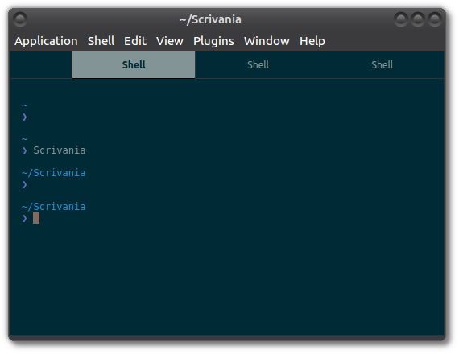
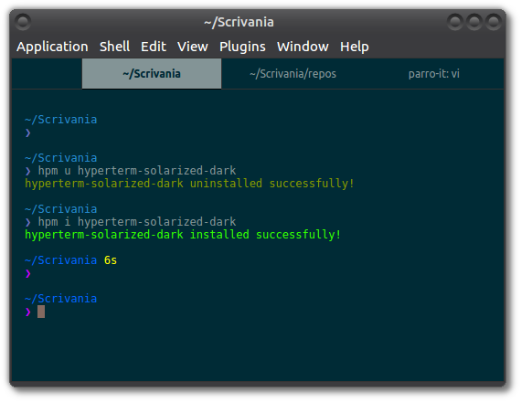

# DEPRECATED

hyperterm-title features are now included in hyper core, so this plugin is now deprecated.
It doesn't work at all from version 1.0.0 of hyper.

# hyperterm-title

> Set the title of your tabs to what your shell suggests

[](http://travis-ci.org/parro-it/hyperterm-title)
[](https://npmjs.org/package/hyperterm-title)
[](https://npmjs.org/package/hyperterm-title)

*Without hyperterm-title*



*With hyperterm-title*



# Installation

First install [hpm](https://github.com/matheuss/hpm), the hyperterm package manager:

```bash
npm install -g hpm-cli
```

Then install `hyperterm-title`:

```bash
hpm i hyperterm-title
```

# Usage

To test this out, you can tell the shell to suggest a different title:

```bash
function title() { echo -e "\033]0;${1:?please specify a title}\007" ; }

title "Hyper Title"
```

# License

The MIT License (MIT)

Copyright (c) 2016 parro-it
